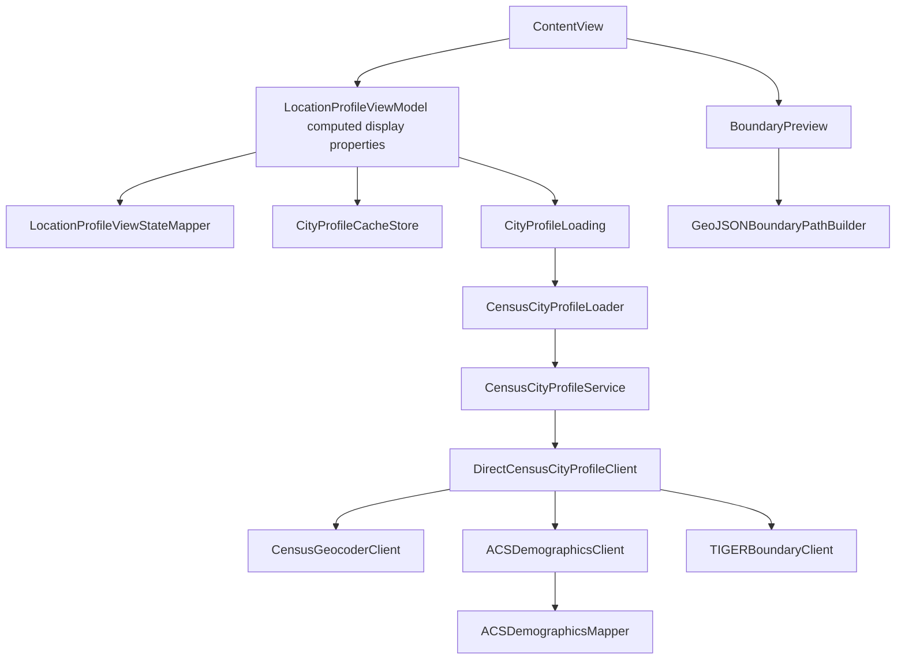

# Lociq

Lociq is a minimal SwiftUI iPhone app that shows a city-level demographic snapshot for the user's current location.

## Current Scope

- Uses Core Location to resolve the current area.
- Uses U.S. Census ACS data for city-level demographics.
- Uses TIGERweb geometry for the city boundary outline.
- Does not use a map view or Google Maps SDK.
- Does not ship localized app strings.

## Architecture

Lociq is intentionally small. The app has one visible product surface and a narrow service pipeline:

1. `ContentView` composes the root SwiftUI shell and owns only top-level UI state such as summary/details mode.
2. `Lociq/Views` contains the visual building blocks: layout metrics, motion timing, bottom identity, demographic content, progress line, background, debug launch override, and boundary drawing.
3. `LocationProfileViewModel` owns app state. It decides when to ask for location access, when to request a location, when to show cached data, when to retry, and when stale network responses must be ignored.
4. `CityProfileCacheStore` persists the last successful city profile independently from the ViewModel.
5. `CityProfileLoading` is the service boundary between UI state and data loading. Tests inject this protocol so location and cache behavior can be verified without hitting the network.
6. `CensusCityProfileLoader` maps service outcomes into either a cacheable `CachedCityProfile` or a minimal unavailable-state snapshot.
7. `CensusCityProfileService` adds in-memory caching for successful demographic lookups and delegates actual network composition to `DirectCensusCityProfileClient`.
8. `DirectCensusCityProfileClient` composes three Census-backed clients:
   - `CensusGeocoderClient` resolves coordinates to Census county/place geography.
   - `ACSDemographicsClient` fetches ACS 5-year city/place estimates.
   - `TIGERBoundaryClient` fetches TIGERweb GeoJSON city/place boundaries.
9. `ACSDemographicsMapper` converts raw ACS values into app demographics, while `ACSDemographicsVariableCatalog` owns the Census variable list.
10. `GeoJSONBoundaryPathBuilder` projects boundary coordinates into a north-up Web Mercator drawing space that visually matches Google Maps orientation without embedding a map SDK.

The UI never talks directly to Census services. It reads a `DemographicSnapshot`, an optional boundary, and a small number of state flags through ViewModel computed properties backed by `LocationProfileViewStateMapper`. This keeps the visual layer minimal and keeps network, cache, and authorization behavior testable.



More detail:

- [Architecture](docs/architecture.md)
- [Location as input architecture](docs/location-as-input-architecture.md)
- [Data sources](docs/data-sources.md)
- [Privacy and data flow](docs/privacy-data-flow.md)

## Model Boundaries

The app separates raw transport concerns from app-domain models:

- `GeographyModels.swift` defines resolved Census geography and the assembled `ResolvedCityProfile`.
- `Demographics.swift` defines normalized app-domain demographic groups such as `HousingDemographics`, `AgeDemographics`, and `MobilityDemographics`.
- `GeoJSONModels.swift` defines the minimal Codable GeoJSON transport shape needed by TIGERweb and the boundary renderer.

ACS JSON is intentionally not passed into SwiftUI. The Census API returns tabular rows keyed by ACS variable codes, so `ACSDemographicsMapper` is the only layer that translates codes such as `B01003_001E` into semantic fields like `population.total`. UI and cache-facing code should use the semantic model, not raw Census dictionaries or variable IDs.

## State Model

The ViewModel uses explicit states instead of loosely coupled booleans:

- `idle`
- `needsLocationPermission`
- `requestingLocation`
- `loading`
- `refreshing`
- `loaded`
- `locationUnavailable`
- `profileUnavailable`

Each profile load is tagged with a request identity. If the user moves, retries, or the app receives a newer coordinate before an older Census request finishes, the older response is ignored. This prevents stale data from replacing newer UI state.

Successful profiles are cached in `UserDefaults` as `CachedCityProfile`. The ViewModel loads the last cached profile during initialization, before `activate()` requests fresh location data. Cache timestamps are assigned by the ViewModel's injected clock so tests can verify cache freshness deterministically. Missing legacy timestamps are treated as stale.

## Data Source

Demographic values are city/place-level ACS 5-year estimates from the U.S. Census API. The current implementation intentionally does not show tract, block group, or ZIP/ZCTA values because those would be misleading when the UI labels the area as a city.

Boundary outlines come from Census TIGERweb. The boundary is decorative context only; the demographic values are keyed to the resolved Census place.

ACS missing or suppressed estimate sentinel values are normalized to unavailable UI values (`--`) before they reach the snapshot layer.

## UI/UX Direction

The interface should stay sparse:

- no search box
- no map view
- no visible technical labels unless a failure state needs one
- one bottom action that changes meaning based on state
- animation should be smooth, low-contrast, and respectful of Reduce Motion

When location access is unavailable, the app should ask for location permission through the single bottom action and otherwise avoid adding extra controls.

## Configuration

Add local secrets in `Config/Secrets.xcconfig`:

```xcconfig
CENSUS_API_KEY = YOUR_CENSUS_API_KEY
```

`CENSUS_API_KEY` is also read from the process environment for local debugging.

## Testing

Run the baseline checks with:

```bash
./scripts/test_baseline.sh
```

The script accepts optional overrides:

```bash
DESTINATION='platform=iOS Simulator,name=iPhone 17 Pro' ./scripts/test_baseline.sh
DERIVED_DATA_PATH=/tmp/lociq-derived-data ./scripts/test_baseline.sh
```

CI runs the same baseline script on pushes to `master` and on pull requests.
