# Lociq

Lociq is a minimal SwiftUI app for iPhone, iPad, and Apple Watch that shows a city-level demographic snapshot for the user's current location.

## Screenshots

Live U.S. Census data, ACS 2020–2024 5-year estimates. Full-size images, at App Store sizes, are in [`Screenshots/`](Screenshots/).

### iPhone

iPhone 17 Pro Max, iOS 26.5 simulator.

<table>
  <tr>
    <td align="center" width="25%">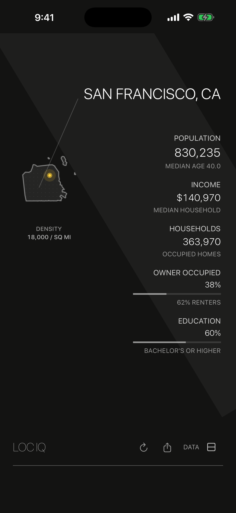<br><sub><b>Summary</b><br>San Francisco, CA</sub></td>
    <td align="center" width="25%">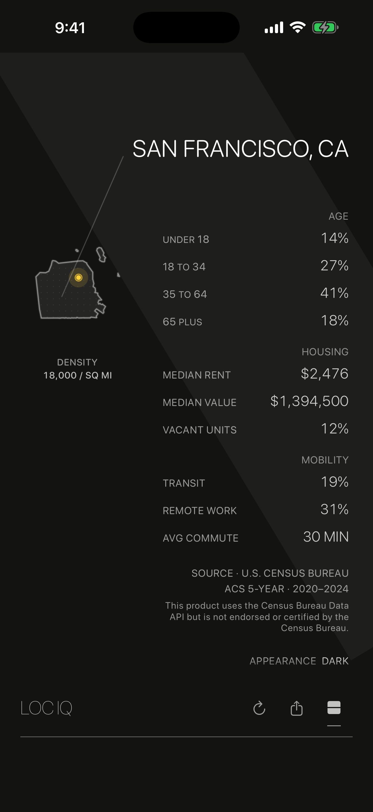<br><sub><b>Details</b><br>Age, housing, commuting, source</sub></td>
    <td align="center" width="25%">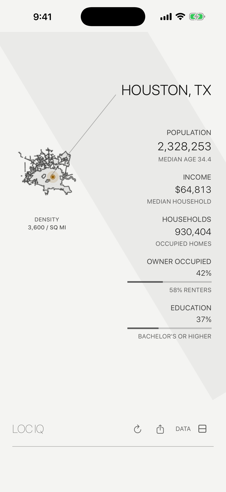<br><sub><b>Light appearance</b><br>Houston, TX, enclaves as holes</sub></td>
    <td align="center" width="25%">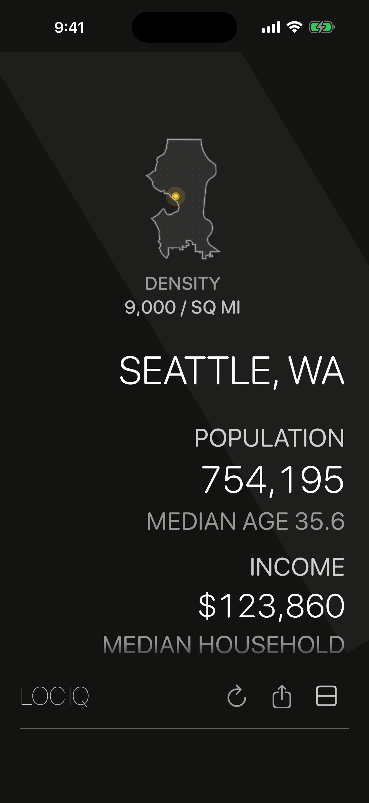<br><sub><b>Large text</b><br>Seattle, WA at AX3</sub></td>
  </tr>
  <tr>
    <td align="center" width="25%">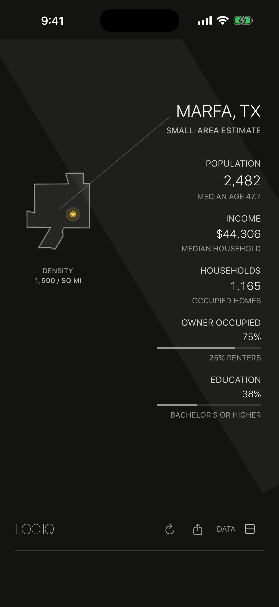<br><sub><b>Small town</b><br>Marfa, TX, small-area caveat</sub></td>
    <td align="center" width="25%">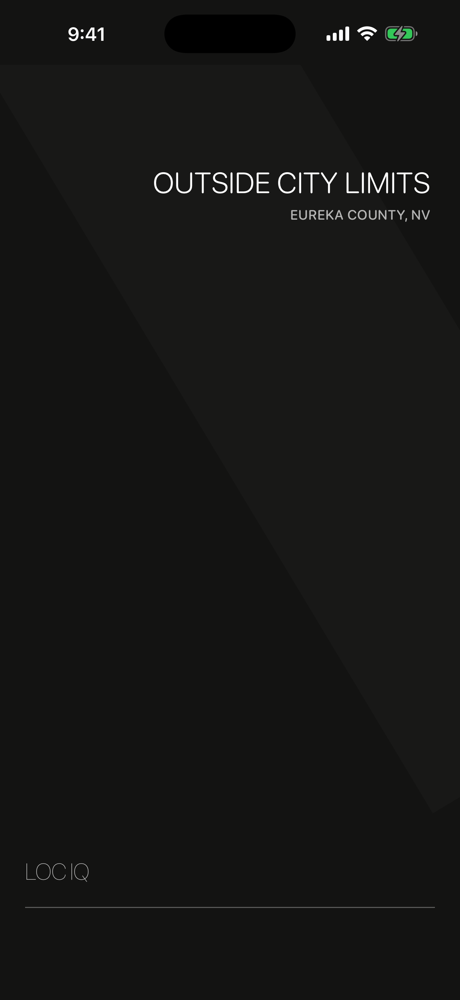<br><sub><b>Outside city limits</b><br>Rural Nevada</sub></td>
    <td align="center" width="25%">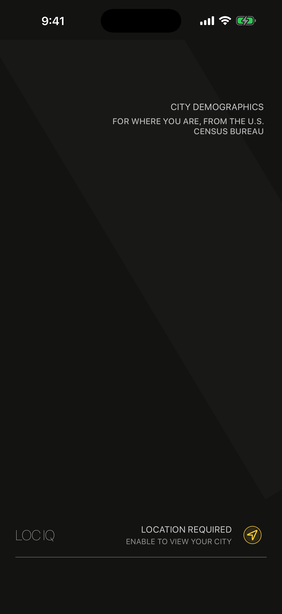<br><sub><b>First run</b><br>Asks for location on tap</sub></td>
    <td align="center" width="25%">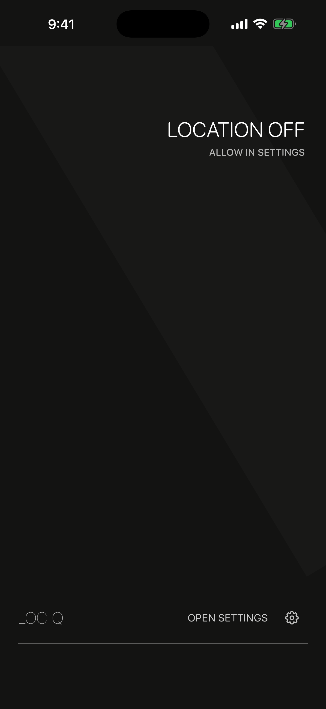<br><sub><b>Location off</b><br>One tap to Settings</sub></td>
  </tr>
</table>

### iPad

iPad Pro 13-inch (M5), iPadOS 26.5 simulator. The composition grows with the window; in landscape the details sit beside the summary.

<table>
  <tr>
    <td align="center" valign="bottom">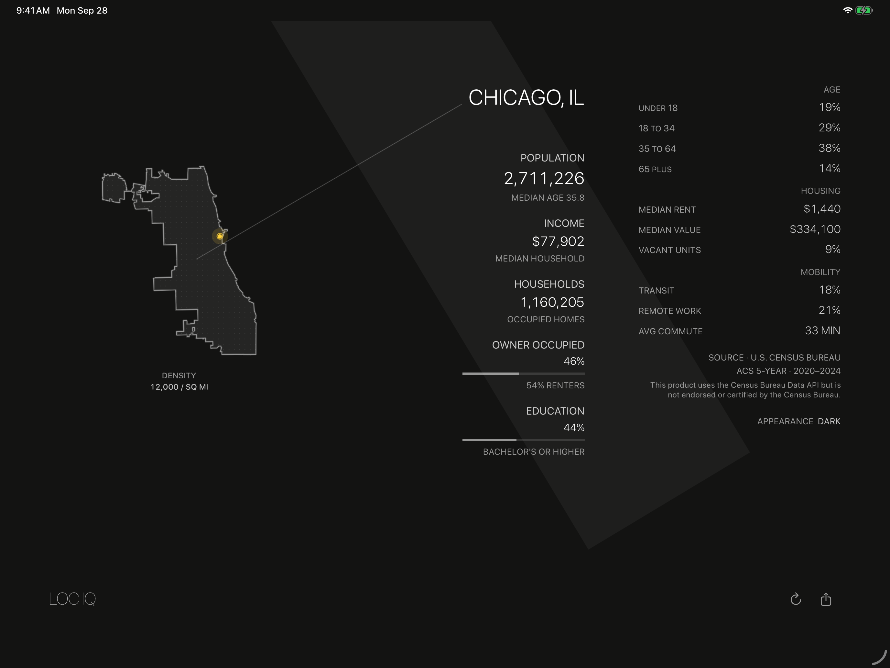<br><sub><b>Landscape</b><br>Chicago, IL, details beside the summary</sub></td>
    <td align="center" valign="bottom">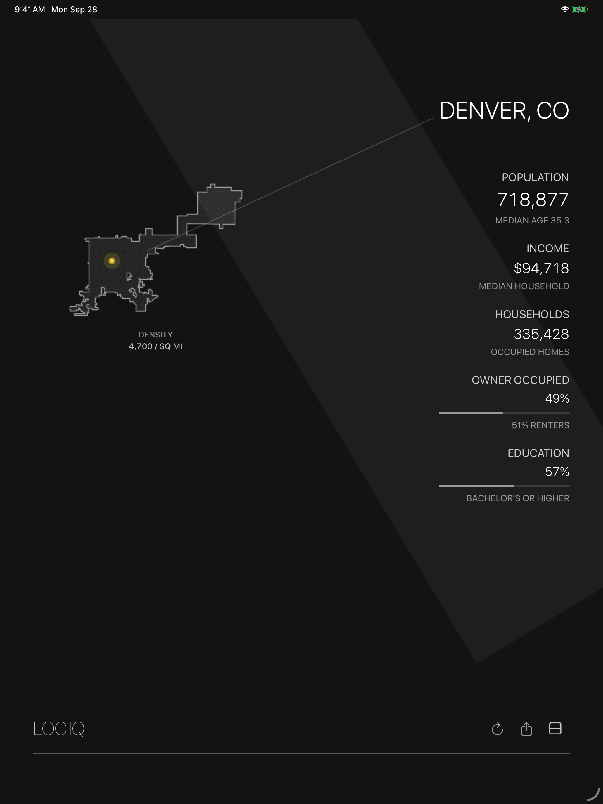<br><sub><b>Portrait</b><br>Denver, CO</sub></td>
  </tr>
</table>

### Apple Watch

Apple Watch Series 11 (46 mm), watchOS 26.5 simulator. Turn the Digital Crown through the pages.

<table>
  <tr>
    <td align="center">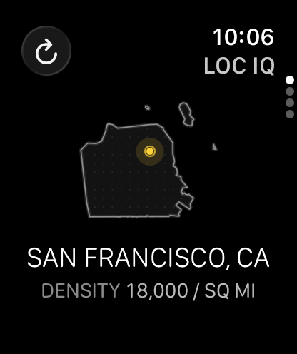<br><sub><b>Place</b></sub></td>
    <td align="center">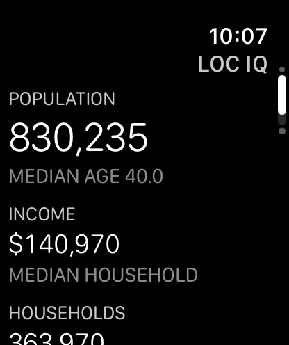<br><sub><b>People</b></sub></td>
    <td align="center">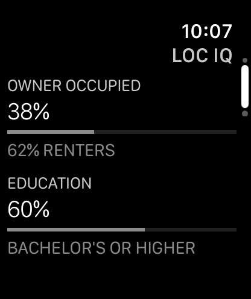<br><sub><b>Homes and education</b></sub></td>
  </tr>
</table>

The screenshots use simulated locations at public landmarks. To retake them, run a Debug build in the simulator, grant location, and set a location with `xcrun simctl location <device> set <latitude>,<longitude>`; `--lociq-ui-fixture-details` opens the details view at launch, and on the watch `--lociq-watch-page <0-3>` opens a page.

## Current Scope

- Runs on iPhone and iPad, with an independent Apple Watch app and watch face complications.
- Uses Core Location to resolve the current area.
- Uses U.S. Census ACS 5-year data for city-level demographics, from the release set by `CensusDataVintage.current`.
- Uses generalized, shoreline-clipped TIGERweb geometry for the city boundary outline and its land area.
- Does not use a map view or Google Maps SDK.
- Does not ship localized app strings.

## Architecture

Lociq is intentionally small. The app has one visible product surface and a narrow service pipeline. Everything below the views is shared by the iPhone and iPad app and the Apple Watch app, in `Shared/`:

1. `ContentView` composes the root SwiftUI shell, owns top-level UI state such as summary/details mode, and routes typed actions. On Apple Watch, `WatchRootView` does the same for the watch pages.
2. `Lociq/Views` contains the iOS building blocks: layout metrics for iPhone and iPad, the Dynamic Type scale, menu commands, bottom identity, demographic content, and the progress line. `Shared/Views` holds what the watch also draws: the palette, motion timing, the boundary preview and marker, the metric bar, and the debug launch overrides.
3. `LocationProfileViewModel` owns app state. It decides when to ask for location access, when to request a location, whether a fix needs a load, how refresh locates first, and when stale network responses must be ignored.
4. `ProfileLoadPlanner` keeps a profile while the user is still in its place and it is from the current data vintage.
5. `CityProfileCacheStore` persists the last successful city profile as a file in Application Support.
6. `CityProfileLoading` is the service boundary between UI state and data loading. Tests inject this protocol so location and cache behavior can be verified without hitting the network.
7. `CensusCityProfileLoader` maps service outcomes into either a cacheable `CachedCityProfile` or an explained unavailable state, within a 25-second budget.
8. `CensusCityProfileService` geocodes, memoizes statistics by place for the session, and delegates network composition to `DirectCensusCityProfileClient`. `CensusServiceGraph` builds the clients once.
9. `DirectCensusCityProfileClient` composes three Census-backed clients:
   - `CensusGeocoderClient` resolves coordinates to Census county/place geography.
   - `ACSDemographicsClient` fetches ACS 5-year city/place estimates.
   - `TIGERBoundaryClient` fetches TIGERweb GeoJSON city/place boundaries.
10. `ACSDemographicsMapper` converts raw ACS values into app demographics, while `ACSDemographicsVariableCatalog` owns the Census variable list.
11. `GeoJSONBoundaryPathBuilder` builds the boundary glyph off the main actor: polygons with holes, projected into north-up Web Mercator and fitted to the part that contains the user, without embedding a map SDK.

The UI never talks directly to Census services. It reads a `LocationProfileViewState` (snapshot, boundary, typed actions, and a few flags) produced by `LocationProfileViewStateMapper`. This keeps the visual layer minimal and keeps network, cache, and authorization behavior testable.

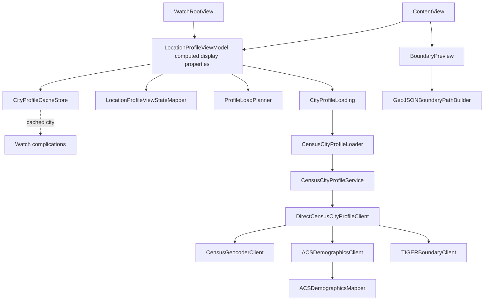
```mermaid
flowchart TD
    A[ContentView] --> B[LocationProfileViewModel computed display properties]
    W[WatchRootView] --> B
    D -.cached city.-> X[Watch complications]
    B --> C[LocationProfileViewStateMapper]
    B --> P[ProfileLoadPlanner]
    B --> D[CityProfileCacheStore]
    B --> E[CityProfileLoading]
    E --> F[CensusCityProfileLoader]
    F --> G[CensusCityProfileService]
    G --> H[DirectCensusCityProfileClient]
    H --> I[CensusGeocoderClient]
    H --> J[ACSDemographicsClient]
    H --> K[TIGERBoundaryClient]
    J --> L[ACSDemographicsMapper]
    A --> M[BoundaryPreview]
    M --> N[GeoJSONBoundaryPathBuilder]
```

The watch app (`LociqWatch/`) and its complications (`WatchComplications/`, `LociqWatchWidgets/`) are separate targets embedded in the iOS app. The complications read a small record the watch app leaves in a shared App Group container: the city's name, population, a simplified outline, and when it was true, with no coordinates. They never locate the wearer.

More detail:

- [Architecture](docs/architecture.md)
- [Location as input architecture](docs/location-as-input-architecture.md)
- [Data sources](docs/data-sources.md)
- [Privacy and data flow](docs/privacy-data-flow.md)

## Model Boundaries

The app separates raw transport concerns from app-domain models:

- `GeographyModels.swift` defines resolved Census geography and the assembled `ResolvedCityProfile`.
- `Demographics.swift` defines normalized app-domain demographic groups such as `HousingDemographics`, `AgeDemographics`, and `MobilityDemographics`.
- `GeoJSONModels.swift` defines the minimal Codable GeoJSON transport shape needed by TIGERweb and the boundary renderer.

ACS JSON is intentionally not passed into SwiftUI. The Census API returns tabular rows keyed by ACS variable codes, so `ACSDemographicsMapper` is the only layer that translates codes such as `B01003_001E` into semantic fields like `population.total`. UI and cache-facing code should use the semantic model, not raw Census dictionaries or variable IDs.

## State Model

The ViewModel uses explicit states instead of loosely coupled booleans:

- `idle`
- `needsLocationPermission`
- `requestingLocation`
- `loading`
- `refreshing`
- `loaded`
- `locationUnavailable`
- `profileUnavailable`

Each profile load is tagged with a request identity. If the user moves, retries, or the app receives a newer coordinate before an older Census request finishes, the older response is ignored. This prevents stale data from replacing newer UI state.

Successful profiles are cached as a `CachedCityProfile` file in Application Support, excluded from backups. The ViewModel loads the last cached profile during initialization, before `activate()` requests fresh location data; profiles cached by earlier builds in `UserDefaults` are migrated once. A cached profile stays valid while the user is in its place and it is from the current data vintage. The status line labels a profile that may not be the user's current place ("LAST LOCATION", "LAST KNOWN AREA", …). The persisted types change by adding optional fields only; see `docs/architecture.md`.

## Data Source

Demographic values are city/place-level ACS 5-year estimates from the U.S. Census API. The current implementation intentionally does not show tract, block group, or ZIP/ZCTA values because those would be misleading when the UI labels the area as a city.

Boundary outlines come from the generalized Census TIGERweb service for the same release. The boundary is context only; the demographic values are keyed to the resolved Census place. Density is population divided by the boundary's Census land area.

ACS missing or suppressed estimate sentinel values are normalized to unavailable UI values (`--`) before they reach the snapshot layer.

## UI/UX Direction

The interface should stay sparse:

- no search box
- no map view
- no visible technical labels unless a failure state needs one; the source and Census API notice live in the details footer
- one primary bottom action that changes meaning based on state, plus refresh and share when a profile is shown
- text scales with Dynamic Type; large sizes switch to one column
- on iPad the same composition grows with the window, and wide windows show the details beside the summary instead of a toggle; the menu bar and keyboard offer Summary (⌘1), Details (⌘2), and Refresh (⌘R)
- on Apple Watch a city is four vertical pages turned with the Digital Crown: the place, people, homes and education, and the details
- animation should be smooth, low-contrast, brief, and respectful of Reduce Motion

When location access is unavailable, the primary action is the one step that helps: ask for permission on first run, open Settings after a denial, or nothing when access is restricted.

## Configuration

Add local secrets in `Config/Secrets.xcconfig`:

```xcconfig
CENSUS_API_KEY = YOUR_CENSUS_API_KEY
```

`CENSUS_API_KEY` is also read from the process environment for local debugging. The watch app reads the same key from the same file.

The Apple Watch app and its complications share the App Group `group.io.chrismahlke.lociq`. With automatic signing, Xcode registers it for your team the first time you build the watch app for a device.

The version and build number live in `Config/Base.xcconfig` and are shared by the iPhone and iPad app, the watch app, and the complications, because App Store Connect rejects an upload whose versions differ.

## Testing

Run the baseline checks with:

```bash
./scripts/test_baseline.sh
```

The script accepts optional overrides:

```bash
DESTINATION='platform=iOS Simulator,name=iPhone 17 Pro' ./scripts/test_baseline.sh
DERIVED_DATA_PATH=/tmp/lociq-derived-data ./scripts/test_baseline.sh
```

CI runs the same baseline script on pushes to `master` and on pull requests, with Xcode 26.6 on a `macos-26` runner. The `Lociq` scheme builds the embedded watch app and complications too.

The iPad layout tests (`LociqIPadTests`) run on iPad destinations and skip on iPhone:

```bash
DESTINATION='platform=iOS Simulator,name=iPad Pro 13-inch (M5)' ./scripts/test_baseline.sh
```

Build and run the watch app on its own with the `LociqWatch` scheme:

```bash
xcodebuild -project Lociq.xcodeproj -scheme LociqWatch -destination 'platform=watchOS Simulator,name=Apple Watch Series 11 (46mm)' build
```

Debug builds accept `--lociq-ui-fixture <cambridge|longName|offline|outsideCityLimits|slow>` to replace Core Location and the Census services with canned data, on iPhone, iPad, and Apple Watch. The UI tests use it, so they need no network or location permission. `--lociq-ui-fixture-details` opens the details view at launch, with a fixture or with live data. On the watch, `--lociq-watch-page <0-3>` opens a page and `--lociq-complication-gallery` draws every complication family.

Release builds fail early when `CENSUS_API_KEY` is empty.
