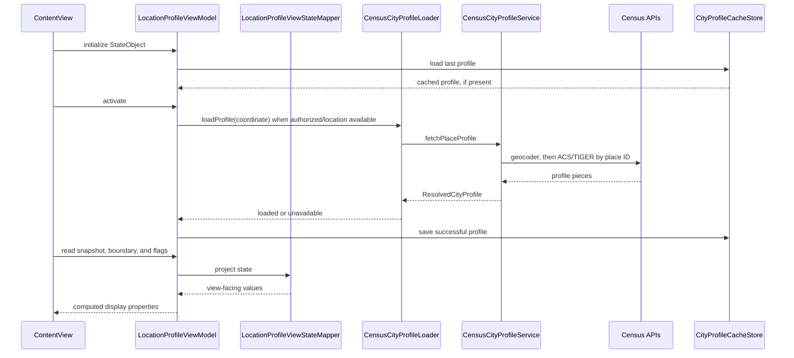

# Architecture

Lociq is a single-surface SwiftUI iPhone app. The product goal is to show one quiet city profile without exposing data-source machinery to the user.

## Runtime Flow

## Responsibilities

- `ContentView` owns only root composition, summary/details toggling, and the first reveal sequence.
- `LocationProfileViewModel` owns permission, location, cache, and async load state.
- `LocationProfileViewStateMapper` projects the state machine into simple view values exposed through ViewModel computed properties, so SwiftUI does not need to understand loading internals.
- `CityProfileCacheStore` persists the last successful profile.
- `CensusCityProfileLoader` converts service results into UI-ready load outcomes.
- `CensusCityProfileService` memoizes successful demographic coordinate lookups during the app session.
- `DirectCensusCityProfileClient` composes geocoder, ACS, and TIGER clients.
- `ACSDemographicsMapper` is the only place that maps ACS variable codes to domain fields.
- `GeoJSONBoundaryPathBuilder` handles Web Mercator projection and display scaling for the outline.

## Failure Design

Failures are intentionally typed:

- network unavailable
- service timeout
- no city match
- no ACS demographic data
- no TIGER boundary
- missing Census API key

Partial failures are allowed. If ACS demographics succeed and TIGER geometry fails, the app can still show city values without the boundary. If a live refresh fails while a cached profile is visible, the cached profile stays visible and is marked stale internally.
